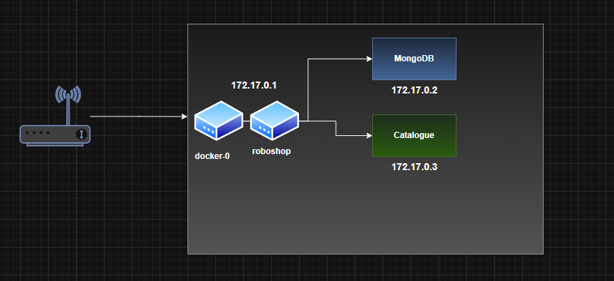

# Docker-roboshop

# All these images are optimized and these images have less size

# As we are not filling any data into the Redis we can directly run the redis container on our Docker host

# Command >>>> docker run -d --name redis --network roboshop redis:7
    indicates that redis is running on roboshop network with the name redis

# As we are creating the Rabbitmq directly via docker compose and we are mentioning the env variables as well in the docker compose file

 # My Docker Credentials
 username - nagashankar1992332

 login to the docker and run docker compose command

 ==========================================

# /var/lib/docker ----> Docker Home directory and all the images that we built are stored here and we need to increase the size of this location when we are creating docker using terrform

## Understanding Roboshop Application Service specific Dockerfiles 

### MONGODB

    Ikkada mongdb lo load chelasina data catalogue msvc lo master-data.js ane filename tho undi basic ga data loading task ni DB team vallu handle chestharu and they dont give any root user to application team or DevOps team

    But, here we are only loading the data directly in mongodb ratherthan running from catalogue msvc, that is the reason why we are keeping master-data.js file in mongodb folder and it loads befor the container starts as we have copied it in the path /docker-entrypoint-initdb.d in Docker

    line no 3 in dockerfile indicates that all the .js files in mongodb folder are being copied to /docker-entrypoint-initdb.d and Docker executes them first as the init script before starting the container.

    actually, its master-data.js which is part of catalogue msvc, but we are running it directly via mongodb as it will be present in mongodb only when we are using application.

    #master-data.js has catagories related data

####  Commands to execute for the creation of MongoDB container

        docker build -t mongodb:v1 .

        docker run -d --name mongodb mongodb:v1

        As we are not exposing the mongodb, we are not using -p command

        docker exec -t mongodb bash >>> to loginto the container in execute mode and see the catagories related data

        docker tag mongodb:v1:latest nagashankar1992332/mongodb:v1:latest   >>> push the image to DockerHub

        exit

### CATALOGUE

####  Understanding the docker image step by step

    ikkada line no-27 lo unna mongodb:27017 is the host. manam separate ga route53 ni em use cheyatledu. name of the container is the name of the host i.e., mongodb
    we already know that mongodb is available on 27017 port no
    RUN npm install installs dependencies
    COPY command makes sure that we are copying all the code into the /opt/server folder 
    And finally, line no-29, manam execute cheyalsina code server.js

    Download the https://roboshop-artifacts.s3.amazonaws.com/catalogue-v3.zip  into our laptop and extract it. And copy the make package.json and server.json so that they are with our dockerfile

####    Below are the steps in understanding the CMD instruction step-by-step

    CMD ["node", "server.js"]
    is the default command that gets executed when a container is started from the image you're building.

    🧠 What CMD Does
    It tells Docker: “When someone runs a container from this image, execute node server.js.”

    This starts your Node.js application by running the server.js file.
    =============

    the word node refers to the Node.js runtime—a JavaScript engine that lets you run JavaScript code outside of a browser, typically on servers.

    🧠 What node Does Here
    It launches the Node.js interpreter.

    It runs the file server.js, which is presumably your backend application or server logic.

    So when the container starts, it’s essentially doing:

    node server.js
    inside the container, which kicks off your app

    ============
    Your Dockerfile starts with:

    FROM node:20
    This means your image is based on the official Node.js version 20 image, which already includes the node command. So you don’t need to install Node.js manually—it’s baked into the image.

    If you want, I can help you verify that server.js is set up correctly to start your app, or walk through how to expose ports and connect it to MongoDB. Just say the word.

####    Commands to execute to create the Catalogue Container

    docker build -t catalogue:v1 .

    docker run -d --name catalogue catalogue:v1

    docker ps

    docker exec -it catalogue sh

    curl http://catalogue:8080/health   >>> to see whther catalogue is properly istalled or not

    exit

    docker tag catalogue:v1:latest nagashankar1992332/catalogue:v1:latest   >>> push the image to DockerHub

    docker have 2 types of network, bridge and host. host means directly host network. bridge means docker creates seperate network interface and assign the IP address to containers..

    when ever we create a container it uses the default network. ANd docker default network "bridge" can't communicate between containers. so, docker always suggest to create custom brige network

    Catalogue and MongoDB cannot connect to eachother via default network, so we are creating the roboshop network

    >> This diagram helps in understanding the network in Docker

####   Commands to create a new network and disconnect and connect to the new network

    docker network create roboshop  >>>  command to create a new network

    docker network disconnect bridge catalogue

    docker network disconnect bridge mongodb

    docker network ls >>> shows our networks

    docker network connect roboshop catalogue

    docker network connect roboshop mongodb

    docker exec -it catalogue bash

    curl localhost:8080/health

    this shows app:OK and mongo:true   >>>> which confirms that catalogue is running fine

### REDIS

    Here we are directly using the existing Docker image for Redis
    
    docker run -d --name redis --network roboshop redis:7 
        indicates that redis is running on roboshop network with the name redis